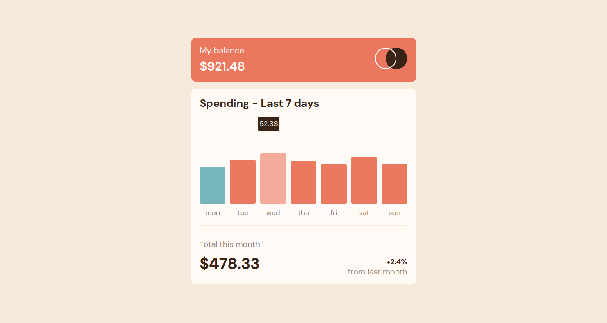

# Frontend Mentor - Expenses chart component solution

This is a solution to the
[Expenses chart component challenge on Frontend Mentor](https://www.frontendmentor.io/challenges/expenses-chart-component-e7yJBUdjwt).

## Table of contents

- [Overview](#overview)
  - [The challenge](#the-challenge)
  - [Screenshot](#screenshot)
  - [Links](#links)
- [My process](#my-process)
  - [Built with](#built-with)
  - [What I learned](#what-i-learned)

## Overview

### The challenge

Users should be able to:

- ✅View the bar chart and hover over the individual bars to see the correct
  amounts for each day
- ✅See the current day’s bar highlighted in a different colour to the other
  bars
- View the optimal layout for the content depending on their device’s screen
  size
- ✅See hover states for all interactive elements on the page
- ✅**Bonus**: Use the JSON data file provided to dynamically size the bars on
  the chart

### Screenshot

 

### Links

- Solution URL: https://github.com/ahmad-kashkoush/expense-chart-component
- Live Site URL: https://expense-chart-component-rho.vercel.app/

## My process

### Built with

- Semantic HTML5 markup
- CSS custom properties
- Flexbox
- Mobile-first workflow
- Javascript to fetch data dynamically

### What I learned

- A little bit brush up on pseudo elements
